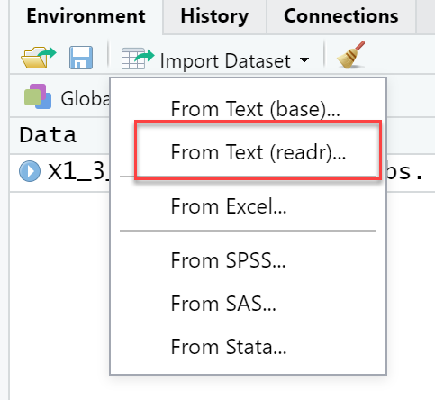
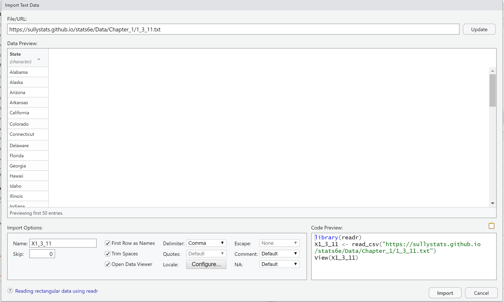

# How to Upload Data to R Studio

Step 1: Select "Import Dataset" from the upper-right window. 

Step 2: Select "From Text (readr...)"  Note: You may need to install or update the package. 

Step 3: After selecting "readr", enter the URL of the data set into the window as shown below.  Note that all data sets on the SullyStats Github are of the form   

https://sullystats.github.io/stats6e/Data/Chapter_#/#_s_n.txt  

where  # is the chapter number
       s is the section number
       n is the problem number

Step 4: Click Update. You should see a preview of the data set. 

Step 5: Click Import. 
